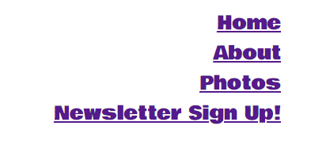

# Welcome to my very first website!

### Overview
My very first website, Cherry Cosplay Conventions, is a website aimed at gamers, and people who enjoy cosplay and meeting up. Specifically designed for players of the iconic video game 'Fortnite' by Epic Games, it is targeted at people of any age group, young or old and who love to dress up.

With more and more people around the world enjoying cosplay, wanting to go out to events and making new friends, I wanted to create the perfect platform for gamers and people alike to be able to do this. It oozes fun, happiness and excitement.  The aim is to get gamers doing something that they'd enjoy and actually seeing faces whilst making friends instead of just receiving friend requests via the game itself and hide away behind the headset. With Mental health issues being so widely spoken about in today's society, is so important to enjoy life. Every being deserves to have fun and shake the stresses of every day life away.

# Features

Consisting of four clickable menu links, my website has a home page, an 'about', a photo / gallery section and a newsletter sign up form. 
All of the menu links on the navigation bar appear on every page.

The website logo also appears on every page and is clcikable. When clicked, this will take you back to the home screen no matter which page you are on.

Colourful and easy to navigate, grabbing interest of Fortnite gamers in particular by using colours from the Fortnite colour palette, a simple but effective first website.

# User Experience (UX)

### The Home Page

The home page includes a colourful image of a group of cosplayers, a small message and upcoming convention dates, everything needed to grab the users attention so that they can explore further through the site. I wanted to get the user engaged immediately with a website that will have them making plans to attend straight away.

### The About Section

I wanted to provide the user with some insight of how my website came about, to show them that it really is important to get out and about, meet new people, but most importantly, have fun.

### The Photos Section

This section shows the user some cosplay photos from previous meets, showing them how much fun it is, but also, that the site is trustworthy by showing people that have met already through the site, which is a very important factor.

### The Newsletter sign up

Providing the user with an opportunity to register interest to keep up to date with a bi-monthly newsletter so that they can get all the latest news direct to their inbox.

## Testing

Testing and validation carried out for all HTML pages with no errors returned via [W3C](https://validator.w3.org/)

Testing and validation carried out for  CSS  with no errors returned via [W3C](https://jigsaw.w3.org/css-validator/)

### Bugs

There were a few challenges i faced within the code itself prior to validating which were simple errors and fixed quickly. My biggest challenge was not realising that i had included /* /* in my css stylesheet as a header note above some style instructions instead of /* */ , resulting in my instructions not being applied, however, this was resolved.

### Deployment

This website was deployed using Github.

The steps that were followed:
Go to Github
Click settings
select pages in the left column
Scroll to 'Build and Deployment'
Go to sub-section and select 'branch'
From the drop down menu where it's set on 'none' click and change to 'main'
click 'save'
Wait a few moments for the link to be deployed. If it doesn't pop up after 30 seconds, refresh the page.
Once done, a pop up message will appear.

Your site is live at:  https://cherrysaz.github.io/Cherry-Cosplay-Conventions/

#### Styling

I used Google Fonts and Font Awesome for styling my website. I wanted to use the correct Fortnite font, however, it would not let me apply it to my site so i found a different one on Google Fonts. Google fonts did not have the Fortnite font that is used in game.

#### Footer

I used Font Awesome for my footer section icons. I included the 5 most popular social media websites that gamers use and displayed them in that order.

##### links

https://fonts.google.com/

https://fontawesome.com/

## Content

All content in the website was built and created by myself, Sara Bakewell. 

## Media

All images included in my website were taken from Google.com.

## Code

Basic html structure has been taken from what i have learnt with the code institute. All coding has been completed by myself.

## Acknowledgements

My ideas and inspirations for my website came from my love for gaming, most particularly, 'Fortnite'. Having started playing it during the pandemic in 2020 and being my most favourite game to play, I started meeting new friends from around the world over the headset, and wondered, will the world ever be the same again, and would we be able to go and meet friends again? I'm extremely pleased to say that the answer was yes.

For further information on Fortnite, please visit: https://www.epicgames.com/site/en-US/home

## Disclaimer

This website is intended for educational purposes only.

